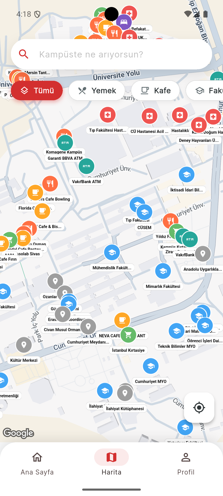
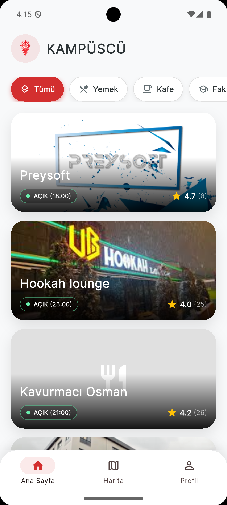
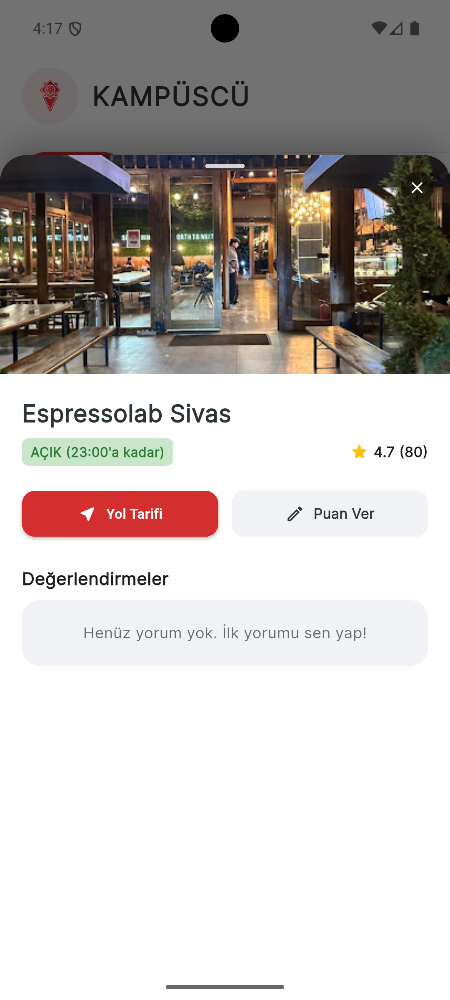
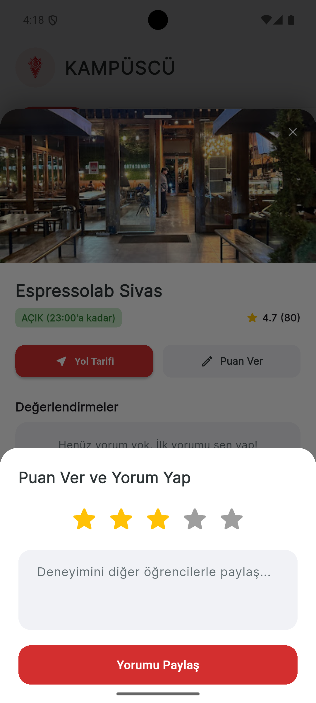
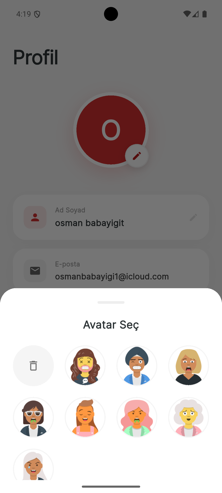

# 📍 KampüsCÜ - Kampüs İçi Rehber ve Sosyal Etkileşim Uygulaması


KampüsCÜ, üniversite öğrencilerinin kampüs içindeki mekanları (fakülteler, kafeler, yemekhaneler, ATM'ler vb.) kolayca bulabilmesi, yol tarifi alabilmesi ve deneyimlerini diğer öğrencilerle paylaşabilmesi için geliştirilmiş **konum tabanlı** bir mobil uygulamadır.

##  Hangi Sorunu Çözüyor?
Özellikle yeni kazanan öğrenciler ve ziyaretçiler için devasa üniversite kampüslerinde yön bulmak karmaşık olabilir. KampüsCÜ;
* Kampüs içindeki tüm önemli noktaları tek bir haritada birleştirir.
* Mekanların güncel açık/kapalı durumlarını gösterir.
* Öğrencilerin mekanlara puan verip yorum yapmasına olanak tanıyarak kampüs içi sosyal bir etkileşim ağı kurar.

##  Temel Özellikler

* **  Kimlik Doğrulama:** Firebase Auth ile güvenli Kayıt Ol / Giriş Yap işlemleri.
* **  Dinamik Kampüs Haritası:** Google Maps API entegrasyonu ile özelleştirilmiş kategori bazlı harita pinleri (Kafe, Yemek, Fakülte, ATM).
* **  Detay ve Yol Tarifi:** Mekanların çalışma saatlerini görme ve tek tıkla Google Haritalar üzerinden yol tarifi alma.
* **  Değerlendirme Sistemi:** Öğrencilerin deneyimlerini paylaşabilmesi için interaktif puanlama (1-5 yıldız) ve yorum yapma özelliği.
* **  Profil Yönetimi:** Kullanıcı bilgilerini güncelleme ve özel avatarlar arasından seçim yapabilme.

##  Ekran Görüntüleri

| Harita Görünümü | Ana Sayfa | Mekan Detayı & Yol Tarifi |
| :---: | :---: | :---: |
|  |  |  |

| Puan & Yorum Yapma | Profil ve Avatar Seçimi | Giriş Yap |
| :---: | :---: | :---: |
|  |  |  |

##  Kullanılan Teknolojiler ve Mimariler

* **Geliştirme Ortamı:** Flutter & Dart
* **Backend & Veritabanı:** Firebase (Authentication, Cloud Firestore)
* **Harita Servisi:** Google Maps API (Custom Markers & Geolocation)
* **Durum Yönetimi (State Management):** Provider
* **Mimari:** Temiz kod prensipleri ve modüler yapı.

##  Kurulum ve Çalıştırma

Bu projeyi kendi bilgisayarınızda çalıştırmak için aşağıdaki adımları izleyin:

**1. Projeyi Klonlayın:**
```bash
git clone [https://github.com/KULLANICI_ADIN/kampuscu.git](https://github.com/KULLANICI_ADIN/kampuscu.git)
